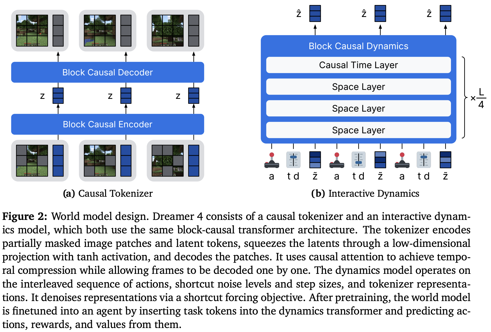

</img>

## Dreamer 4 (wip)

Implementation of Danijar's [latest iteration](https://arxiv.org/abs/2509.24527v1) for his [Dreamer](https://danijar.com/project/dreamer4/) line of work

[Temporary Discord](https://discord.gg/MkACrrkrYR)

## Citation

```bibtex
@misc{hafner2025trainingagentsinsidescalable,
    title   = {Training Agents Inside of Scalable World Models}, 
    author  = {Danijar Hafner and Wilson Yan and Timothy Lillicrap},
    year    = {2025},
    eprint  = {2509.24527},
    archivePrefix = {arXiv},
    primaryClass = {cs.AI},
    url     = {https://arxiv.org/abs/2509.24527}, 
}
```

```bibtex
@misc{xiong2025ndrope,
    author = {Jerry Xiong},
    title  = {On n-dimensional rotary positional embeddings},
    year   = {2025},
    url    = {https://jerryxio.ng/posts/nd-rope/}
}
```
